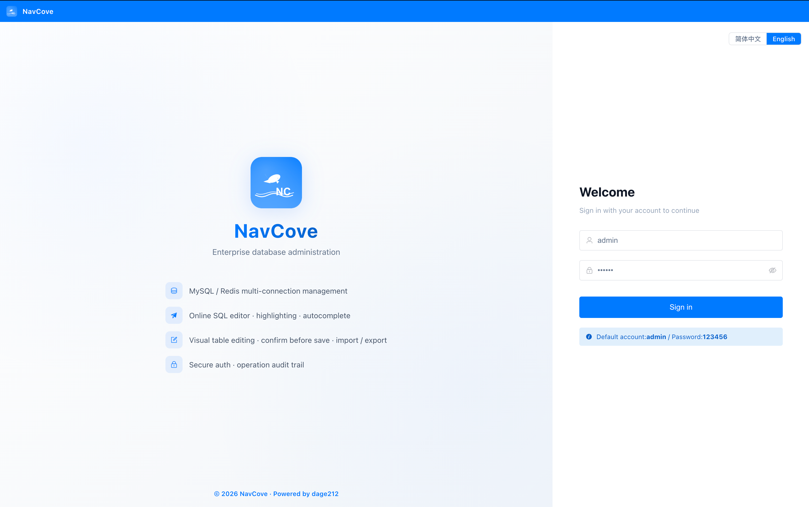
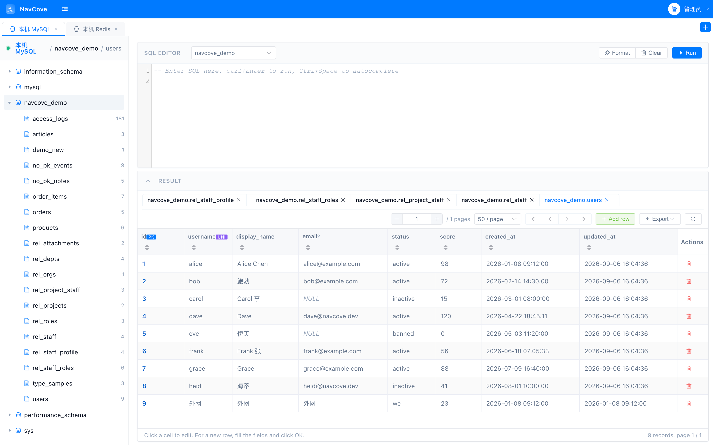
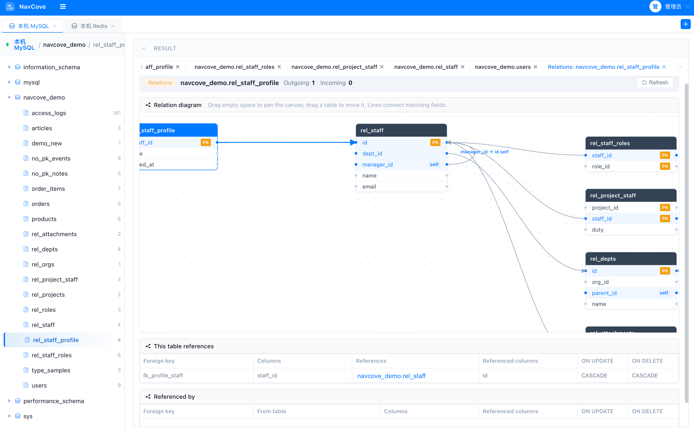
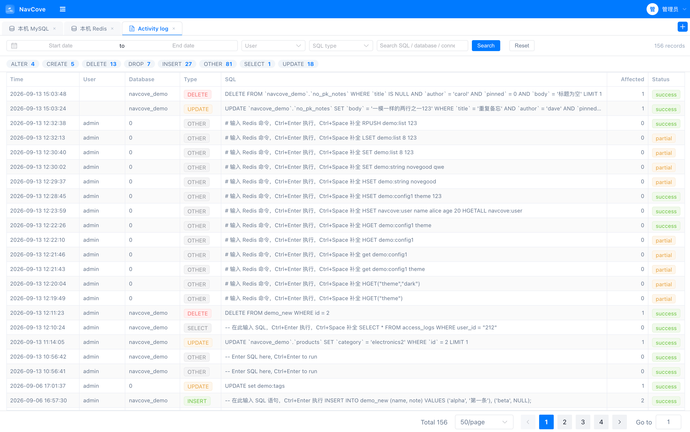

**[English](./README.md)** | **中文**

# NavCove — 跨平台数据库管理工具

类 Navicat 的桌面端数据库管理工具，基于 Electron 打包。同一窗口里管理 **MySQL** 和 **Redis**：多连接页签、SQL / Redis 命令编辑、表数据可视化增删改（含无主键表）、外键关系图、CSV/SQL 导入导出、操作日志审计。界面支持 **简体中文** 和 **English**。

默认账号：`admin` / `123456`。

## 截图

### 登录

登录页可切换语种后进入工作台。



### 工作台

连接页签、库表树、SQL 编辑器、可编辑结果表。打开多张表时，页签标题为 `库.表`。



### 表关系

表上右键 → **查看表关系**。按外键画出字段到字段的连线；空白处拖动画布，拖动卡片移动表。



### 操作日志

记录每次 SQL / Redis 命令，可按日期、人员、语句类型筛选。



## 技术栈

- **桌面**：Electron + electron-builder（macOS 原生交通灯 / Windows 自定义窗口控制）
- **前端**：Vue 3 + Element Plus + Vite + CodeMirror 5（SQL 高亮/补全/注释切换）
- **后端**：Node.js + Koa + mysql2 + ioredis + better-sqlite3
- **数据库**：MySQL / Redis（业务库）+ SQLite（用户/连接/操作日志元数据）

## 目录结构

```
NavCove/
├── electron/                    # Electron 主进程
│   └── main.js                  # 窗口创建、平台自适应标题栏
├── server/                      # 后端 Koa 服务
│   ├── app.js                   # 入口（CORS/静态托管/SPA 回退/错误处理）
│   ├── config.js                # 默认连接配置
│   ├── db/sqlite.js             # SQLite：users/connections/operation_log 表
│   ├── db/pool.js               # MySQL / Redis 连接池（按连接 ID 缓存）
│   ├── services/mysqlService.js # MySQL 业务（查询/CRUD/DDL/表关系/CSV·SQL 导入导出）
│   ├── services/redisService.js  # Redis key / 命令
│   ├── services/uploadService.js# CSV 分片上传/断点续传/合并
│   └── routes/index.js          # API 路由 + 操作日志记录
├── web/                         # 前端 Vue 应用
│   ├── src/
│   │   ├── App.vue              # 主布局（标题栏/连接页签/侧栏/编辑器+结果/拖动分隔）
│   │   ├── api/index.js         # axios 封装
│   │   ├── components/
│   │   │   ├── TitleBar.vue          # 标题栏（平台窗口控制/用户菜单）
│   │   │   ├── ConnectionDialog.vue  # 连接管理弹窗
│   │   │   ├── ImportDialog.vue      # CSV 导入弹窗（分片上传）
│   │   │   ├── ExportSqlDialog.vue   # SQL 导出弹窗
│   │   │   ├── ResultTable.vue       # 结果表格（编辑/增删行/导出）
│   │   │   ├── StructureView.vue     # 表结构查看
│   │   │   ├── RelationView.vue       # 表关系图（外键）
│   │   │   └── OperationLog.vue      # 操作日志页签
│   │   └── styles/main.css     # 全局样式（iOS 蓝主题）
│   └── vite.config.js          # dev 代理 /api -> :3000
└── package.json                # Electron 打包配置
```

## 快速开始

### 1. 安装依赖

需要 **Node.js 23.7.0**（见 `.nvmrc` / `package.json` 的 `engines`）。项目是 **npm workspace**，在根目录执行一次即可同时安装 `web`、`server` 和 Electron 依赖：

```bash
# 在根目录执行
nvm use          # 切换到 23.7.0
npm install      # 安装 web + server + 根目录 Electron 依赖
```

> 包管理器：npm。[.npmrc](./.npmrc) 里 `engine-strict=true`，Node 版本不对会直接失败。

### 2. 开发模式（一键启动后端 + 前端 + Electron）

```bash
# 在根目录执行
npm run dev      # 后端 :3000 + 前端 :5173 + Electron 桌面窗口
```

其它命令：

```bash
npm run dev:web       # 仅前端
npm run dev:server    # 仅后端
```

### 3. 打包发行

```bash
npm run dist:win     # Windows NSIS + portable
npm run dist:mac     # macOS dmg + zip
npm run dist:linux   # Linux AppImage + deb
```

产物输出到 `release/` 目录。

## 功能说明

| 模块 | 功能 |
|------|------|
| 用户认证 | 登录/登出（SQLite users 表 + Session Token） |
| 连接管理 | 多连接页签（每连接独立 SQL/结果/树状态）、MySQL 与 Redis 可同时打开、测试连接、新建/关闭 |
| 库表浏览 | 左侧树懒加载数据库→表（或 Redis 库→key），表节点显示行数（COUNT(*) 精确值） |
| SQL 编辑器 | CodeMirror 5 高亮/补全/括号匹配、Ctrl+/ 注释切换、Ctrl+Enter 执行、数据库下拉切换、可拖动高度 |
| SQL 执行 | 多语句分号切分、SELECT 返回结果集、写操作返回影响行数、错误定位 |
| 结果表格 | 分页(20/50/100/200)、列排序、表头固定内部滚动、新增行 sticky 置顶、多结果 Tab |
| 表数据编辑 | 行内编辑、新增行、单行删除、批量保存（事务）、SELECT 结果亦可编辑；无主键表按整行匹配定位 |
| 表关系 | 按外键绘制 ER 图：拖动画布、拖动表卡片、连线落在字段上；下方列出本表引用 / 引用本表 |
| CSV 导入 | 分片上传 + 断点续传 + 合并、INSERT 追加 / REPLACE 覆盖、非标准日期格式自动转换 |
| CSV 导出 | 表数据导出 / 查询结果导出（流式生成，UTF-8 BOM，Excel 兼容） |
| SQL 导出 | 表结构(CREATE TABLE) + 数据(INSERT) 整表导出、查询结果导出为 INSERT |
| SQL 导入 | 导入 .sql 文件执行（支持转义、多语句） |
| DDL 操作 | 建表/删表/清空/复制/重命名表、建库/删库/改字符集（含确认校验） |
| 表结构 | 查看表字段/类型/索引/DDL |
| 操作日志 | 记录所有 SQL 操作（用户/时间/类型/完整 SQL/影响行数/状态），支持日期/人员/SQL 类型过滤 |
| 布局交互 | 侧栏宽度可拖动、编辑器与结果区高度可拖动、侧栏可折叠；简体中文 / English |
| 平台适配 | macOS 原生交通灯按钮、Windows/Linux 自定义窗口控制、iOS 蓝主题 |

## 默认连接

`server/config.js` 配置默认连接（本机 MySQL root 无密码）。如需修改，编辑该文件或在前端"新建连接"弹窗中填写。

## 元数据存储

SQLite 数据库（`server/data/app.db`）存储：
- `users` — 系统用户
- `connections` — 保存的数据库连接
- `operation_log` — SQL 操作审计日志
